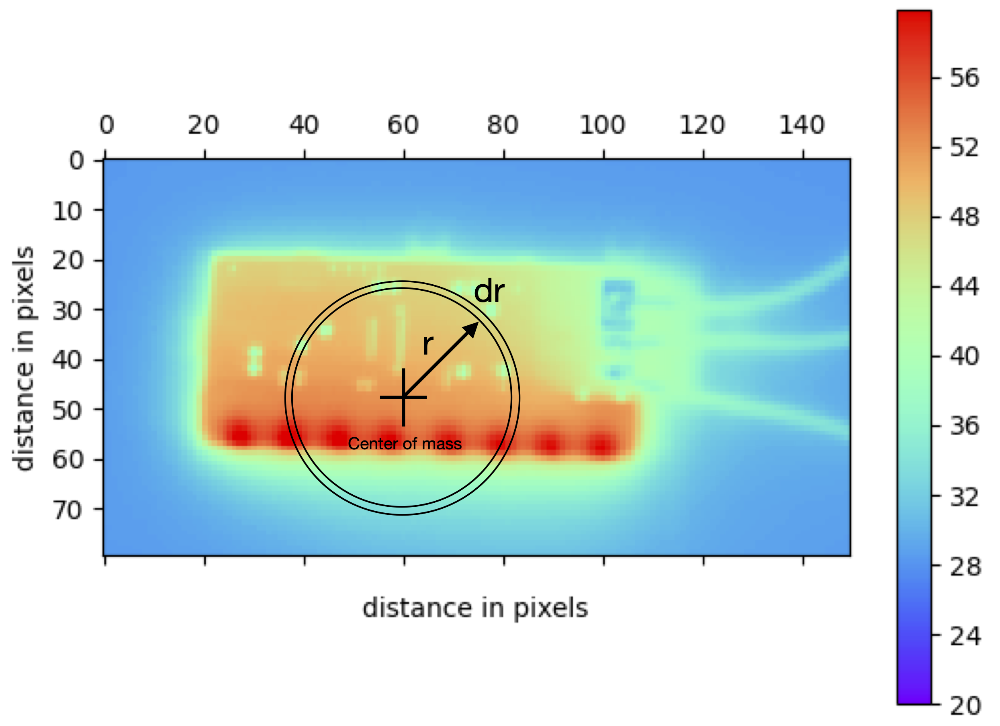

# QCHeatMaps
Souvik Das, 2022  
souvik1982@gmail.com

This is a fast algorithm for Quality Control using heatmaps or greyscale images of products. It reports the similarity between a product's reference heatmap and the heatmap of a particular product on the factory floor as a number between 0 (bad) and 1 (good). It disregards image rotations, image scale, temperature offsets and scale, and small variations of optical focusing.

The algorithm is being developed in the context of Quality Control for silicon detector readout chips in the Inner Tracker of the Compact Muon Solenoid Detector (Phase II) at the Large Hadron Collider. It relies on an application of the <a href="https://www.itl.nist.gov/div898/handbook/eda/section3/eda35g.htm">Kolmogorov-Smirnov Goodness of Fit test</a> on heatmap data. Outlined below are the steps.

<ul>
<li> Detect the foreground and eliminate the background </li>
 <ul>
 <li> Histogram the heatmap's temperature data </li>
 <li> Use k-means clustering to identify and set the largest cluster to zero </li>
 <li> Normalize the heatmap such that the sum of all pixels = 1 </li>
 </ul>
<li> Find the center of mass and scale of the image </li>
 <ul>
 <li> Find the image center $\vec{r_c}$ using the first moment: $M\vec{r_c} = \int{\vec{r} dm}$ </li>
 <li> Find the image scale $r_s$ using the second moment: $Mr_s^2 = \int{r^2 dm}$ </li>
 </ul>
<li> Scan rings of radius $r$ and thickness $\delta r$ from center to boundary </li>
 <ul>
 <li> Add temperatures of all pixels falling within the ring and call it $T$ </li>
 <li> This can be done fast by scanning only over pixels with an outer boundary box of $(-r-\delta r, -r-\delta r, r+\delta r, r+\delta r)$ and an inner boundary box of $(-r/\sqrt{2}, -r/\sqrt{2}, r/\sqrt{2}, r/\sqrt{2})$ around the image center $\vec{r_c}$, and finding pixels that fall within the ring. </li>
 </ul>
<li> Plot a graph of $T$ vs $r/r_s$ </li>
<li> Given these graphs for two images, use the Kolmogorov-Smirnov test to find the similarity between them from 0 to 1. </li>
</ul>

Normalizing the temperatures disregards temperature offsets and scale. Scanning radially from the center of mass eliminates variations from rotation. Dividing the radius by the scale eliminates the scale of the image. Since the KS-statistic works on the cumulative distribution function, it does not penalize bin migrations between adjacent bins twice as a $\chi^2$ test would, thus developing an immunity against a lack of perfect optical focus.
